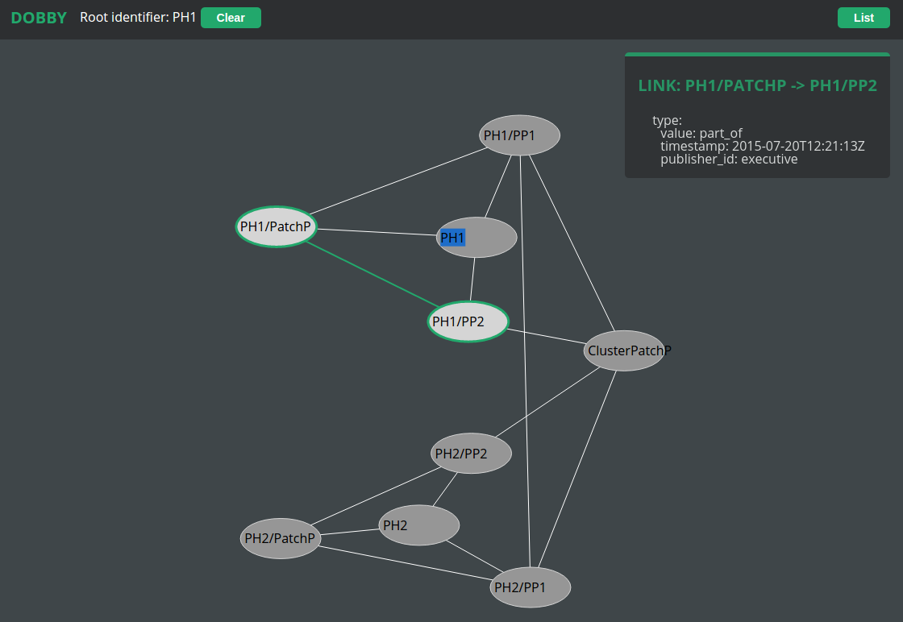
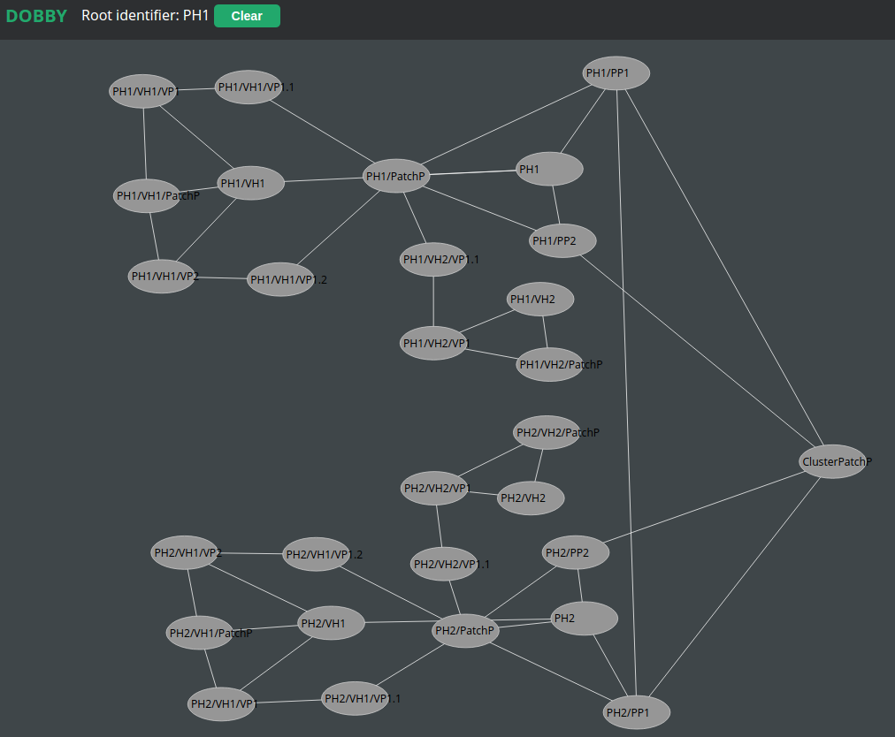
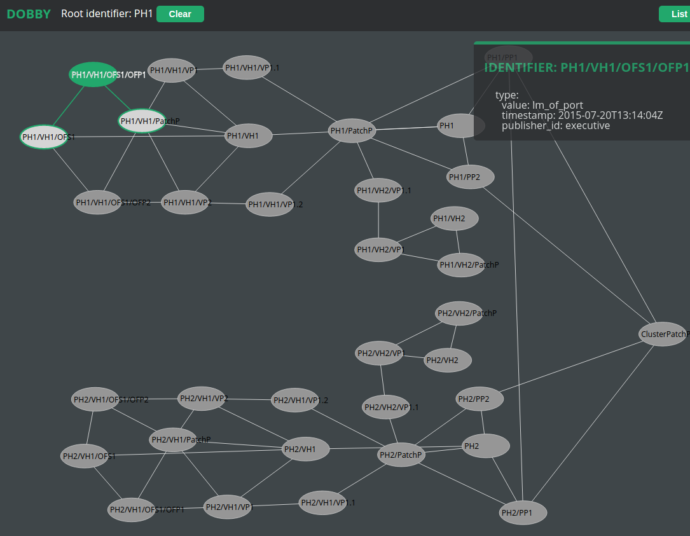
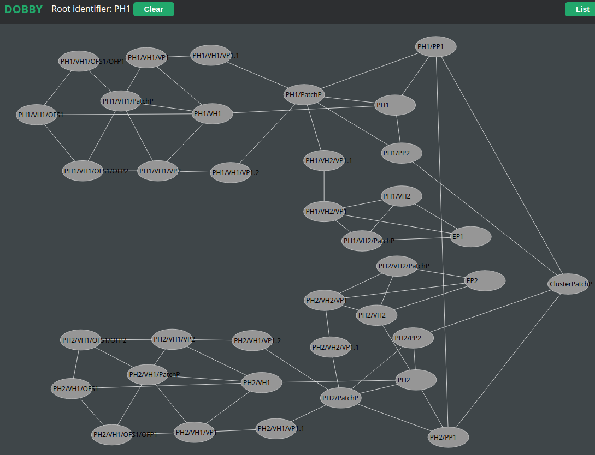
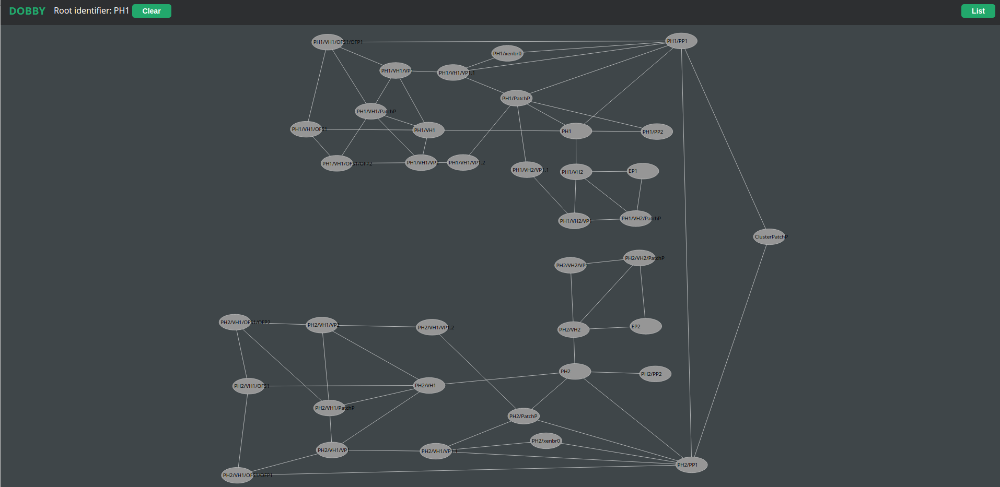
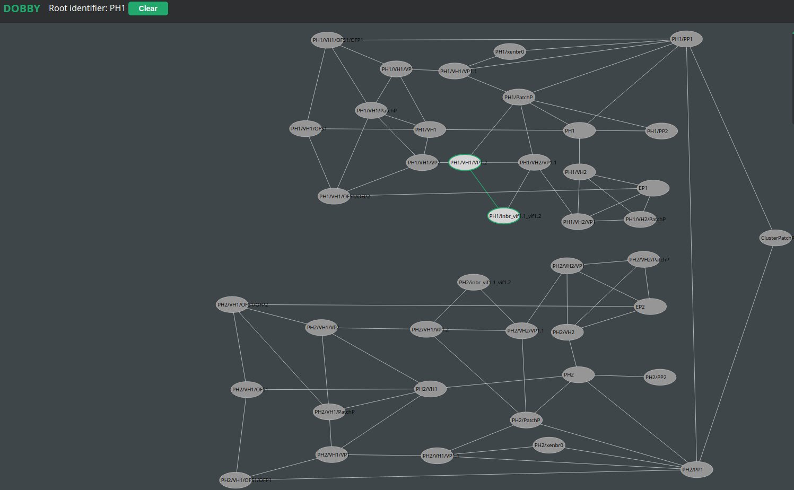

# How to run Publishers with Lucet

<!-- markdown-toc start - Don't edit this section. Run M-x markdown-toc/generate-toc again -->
**Table of Contents**

- [How to run Publishers with Lucet](#how-to-run-publishers-with-lucet)
    - [Buliding and starting required components](#buliding-and-starting-required-components)
        - [Setting up Dobby with REST interface and UI](#setting-up-dobby-with-rest-interface-and-ui)
        - [Setting up Lucet](#setting-up-lucet)
        - [Setting up Executive](#setting-up-executive)
    - [Publising a cluster](#publising-a-cluster)
        - [Publishing Physical Hosts](#publishing-physical-hosts)
        - [Publishing Virtual Hosts](#publishing-virtual-hosts)
        - [Publishing OpenFlow switches](#publishing-openflow-switches)
        - [Publishing Endpoints](#publishing-endpoints)
    - [Wiring](#wiring)
        - [Wiring OpenFlow Ports](#wiring-openflow-ports)
        - [Wiring Endpoints](#wiring-endpoints)
    - [Generating domain configs](#generating-domain-configs)

<!-- markdown-toc end -->


## Buliding and starting required components

### Setting up Dobby with REST interface and UI

To setup dobby run:

```shell
git clone https://github.com/FlowForwarding/dobby.git && cd dobby
make rebar && make generate
rel/dobby/bin/dobby console
```

To setup UI run:

```shell
git clone https://github.com/FlowForwarding/dobby_ui.git && cd dobby_ui
npm install
```

To setup dobby_rest:

```shell
git clone https://github.com/shivarammysore/dobby_rest && cd dobby_rest
make rebar && make all
ln -s {PATH}/dobby_ui/www rel/dobby_rest/lib/dobby_rest-1/priv/static/www
rel/dobby_rest/bin/dobby_rest console
```

Go to the http://localhost:8080/static/www/index.html.

### Setting up Lucet

```shell
git clone https://github.com/FlowForwarding/lucet && cd lucet
make run
```

Now test that the Lucet is connected with Dobby:

```erlang
nodes().
```

The output of the above command should be `['dobby@127.0.0.1','dobby_rest@127.0.0.1']`.

### Setting up Executive

```shell
git clone https://github.com/FlowForwarding/executive.git && cd executive
make rel
./_rel/executive/bin/executive
```
This should bring up the console that will be used to publish stuff
into Dobby. Before moving on check that the Executive is connected with dobby:

```erlang
nodes().
```

The output should contain dobby node.

> It is alsbo possible to access the Executive node via ssh. See instructions
> in the Executive README file.

## Publising a cluster

The instructions below explain how to publish a cluster consisting of:
* 2 Physical Hosts (PH) with 2 Physical Ports (PP) each
* 2 Virtual Hosts (VH) on each of the PH
* 1 OF Switch running on the first VH of each PH
* 1 endpoint running on the second VH of each PH

> Detailed documentation on the Executive's publishers API can be found
> [here](https://docs.google.com/document/d/1t46Qff5vU83f7O-J5AJWfWWl5XdGWdWgix8IbSQfkYg/edit#heading=h.foph20hrik1q).

### Publishing Physical Hosts

Publish Physical Host "PH1" with two physical ports "PP1" and "PP2":

```erlang
Ports = 
   [{"PP1", #{mac_address => "00:00:00:00:01:AA", interface => "eth0"}},
    {"PP2", #{mac_address => "00:00:00:00:01:AB", interface => "eth1"}}].
executive:publish_physical_host("ClusterPatchP", "PH1", Ports).
```

Then, analogously publish Physical Host "PH2" with two Physical Ports:

```erlang
Ports2 = 
   [{"PP1", #{mac_address => "00:00:00:00:02:AA", interface => "eth0"}},
    {"PP2", #{mac_address => "00:00:00:00:02:AB", interface => "eth1"}}].
executive:publish_physical_host("ClusterPatchP", "PH2", Ports2).
```

In the end, connect the two PHs by adding a 'bound_to' link between them
than indicates that the PHs are physically connected. We will put the link
between ports PP1 on each PH.

```erlang
executive:bound_physical_hosts("PH1", "PP1", "PH2", "PP1").
```

In the Dobby Visualizer check that everything is published as expected:



### Publishing Virtual Hosts

We need two VHs on each PH. Create first of them called "PH1/VH1" on "PH1".
It will host OFS switch "OFS1" with 2 ports thus we need that it has 2 ports:


```erlang
VirtualPorts11 = 
   [{"VP1", #{mac_address => "00:00:00:00:11:AA", interface => "eth0"}},
    {"VP2", #{mac_address => "00:00:00:00:11:AB", interface => "eth1"}}].
VifPorts11 = 
   [{"VP1.1", #{vp_to_bound => "VP1", interface => "vif1.1"}},
    {"VP1.2", #{vp_to_bound => "VP2", interface => "vif1.2"}}].
executive:publish_virtual_host("PH1", "PH1/VH1", VirtualPorts11, VifPorts11).
```

Create another VH that will host an endpoint:

```erlang
VirtualPorts12 = 
   [{"VP1", #{mac_address => "00:00:00:00:12:AA", interface => "eth0"}}].
VifPorts12 = 
   [{"VP1.1", #{vp_to_bound => "VP1", interface => "vif2.1"}}].
executive:publish_virtual_host("PH1", "PH1/VH2", VirtualPorts12, VifPorts12).
```

Repeat the steps for the "PH2":

```erlang
VirtualPorts21 = 
   [{"VP1", #{mac_address => "00:00:00:00:21:AA", interface => "eth0"}},
    {"VP2", #{mac_address => "00:00:00:00:21:AB", interface => "eth1"}}].
VifPorts21 = 
   [{"VP1.1", #{vp_to_bound => "VP1", interface => "vif1.1"}},
    {"VP1.2", #{vp_to_bound => "VP2", interface => "vif1.2"}}].
executive:publish_virtual_host("PH2", "PH2/VH1", VirtualPorts21, VifPorts21).
VirtualPorts22 = 
   [{"VP1", #{mac_address => "00:00:00:00:22:AA", interface => "eth0"}}].
VifPorts22 = 
   [{"VP1.1", #{vp_to_bound => "VP1", interface => "vif2.1"}}].
executive:publish_virtual_host("PH2", "PH2/VH2", VirtualPorts22, VifPorts22).
```

In the Dobby Visualizer check that everything is published as expected:



### Publishing OpenFlow switches

Now we'll publishg OpenFlow switch "PH1/VH1/OFS1" that will be running
on "PH1/VH1":

```erlang
OfPorts1 = 
   [{"OFP1", #{vp_to_bound => "VP1"}},
    {"OFP2", #{vp_to_bound => "VP2"}}].
executive:publish_of_switch("PH1/VH1", "PH1/VH1/OFS1",  OfPorts1).
```
And the same for the other PH:

```erlang
OfPorts2 = 
   [{"OFP1", #{vp_to_bound => "VP1"}},
    {"OFP2", #{vp_to_bound => "VP2"}}].
executive:publish_of_switch("PH2/VH1", "PH2/VH1/OFS1",  OfPorts2).
```

After publishing the Switches Dobby Visualizer content should look like
this:



### Publishing Endpoints

Finally we will add Endpoint to the second VMs on the PHs:

```erlang
executive:publish_endpoint("PH1/VH2", "EP1", "VP1").
executive:publish_endpoint("PH2/VH2", "EP2", "VP1").
```

Finally we will end up with topology like this:



## Wiring

Start Lucet invoking `make run` in its directory. Verify that it is
connected to the dobby node by checking the output of `nodes().` in the
Lucet console. Also install `lucet` module into dobby: `dby:install(lucet)`.

>> Installing should be done automatically but for some reason it's not
>> working now.

### Wiring OpenFlow Ports

Let's assumet that we want to bound the OF Ports "OFP1" on each OFS. We
already have a link between PPs "PP1" on each VH so we need to bound
the OFPs to PPs. All the below commands need to be typed in the Lucet
console.

>> Note that when publishing, all the created identifiers got prefixes
>> after related hosts. For example `OFP1` attached to `PH1/VH1/OFS1` got
>> the prefix `PH1/VH1/OFS1/` and is represented in Dobby as `PH1/VH1/OFS1/OFP1`.
>> That may sound weird but that's the current state.

>> Another inconvenience is that now, Lucet API accepts Erlang binaries, i.e.
>> string enclosed in the <<...>>.

```erlang
lucet:wire(<<"PH1/VH1/OFS1/OFP1">>, <<"PH1/PP1">>).
lucet:wire(<<"PH2/VH1/OFS1/OFP1">>, <<"PH2/PP1">>).
```

>> We're not calling `lucet:wire(<<"PH1/VH1/OFS1/OFP1">>, <<"PH2/VH1/OFS1/OFP1">>).`
>> because there're several possible paths between the OFPs - the "PH1/PP2"
>> or "PH2/PP2" could be used. Lucet currently doesn't know how to choose the corrent
>> one - for example it could only consider PP1s as they're bouned.

After this wiring the scheme should look like following:


### Wiring Endpoints

Now wire `EP1` and `EP2` to `PH1/VH1/OFS1/OFP1` and `PH2/VH1/OFS1/OFP1`
respectively.

```erlang
lucet:wire(<<"PH1/VH1/OFS1/OFP2">>, <<"EP1">>).
lucet:wire(<<"PH2/VH1/OFS1/OFP2">>, <<"EP2">>).
```

The result should be like the following:

.

## Generating domain configs

Now to generate a domain config file any of the Virtual hosts invoke:

```erlang
lucet:generate_lincx_domain_config("PH1/VH1", "00:00:00:AA:BB:00").
vif = ['mac=00:00:00:AA:BB:00,bridge=xenbr0',
       'bridge=inbr_vif1.1_vif1.2',
       'bridge=xenbr0']
```

```erlang
lucet:generate_lincx_domain_config("PH1/VH2", "00:00:00:AA:BB:00").
vif = ['mac=00:00:00:AA:BB:00,bridge=xenbr0',
       'bridge=inbr_vif1.1_vif1.2']
```

As you can see in the first snippet for the VH with LINCX it has to
entries with xenbr0. It is because "PH1/PP1" is assigned to `eth0`
and thus Lucet thinks that it is attached to `xenbr0`. If it had been
attached to `eth1` the vif would look like this:

```
vif = ['mac=00:00:00:AA:BB:00,bridge=xenbr0',
       'bridge=inbr_vif1.1_vif1.2',
       'bridge=xenbr1']
```


